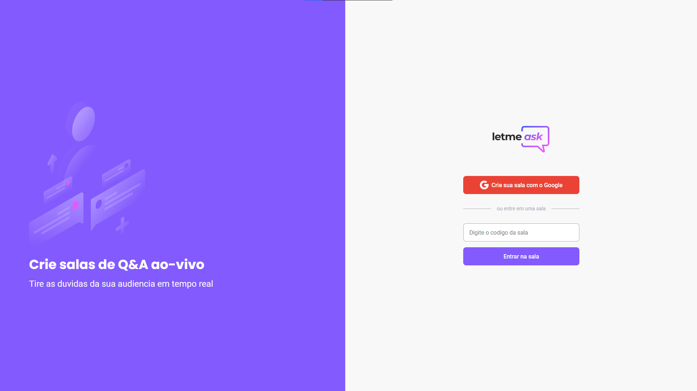
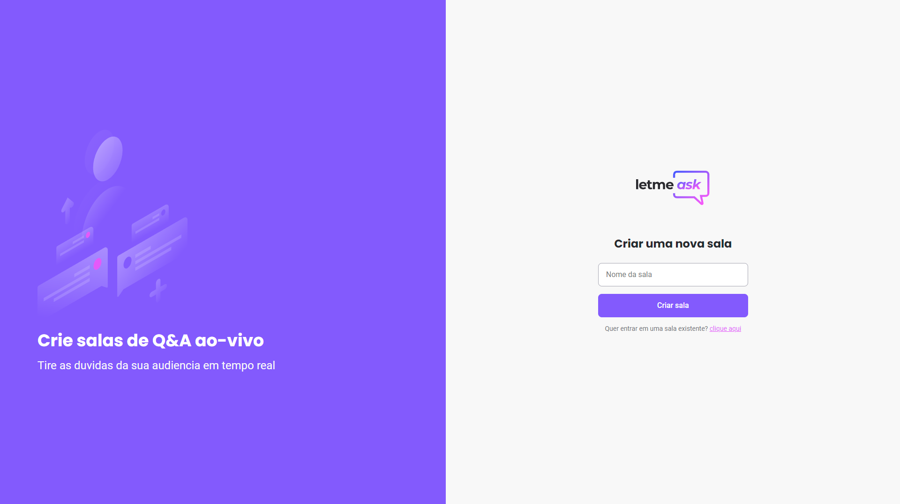
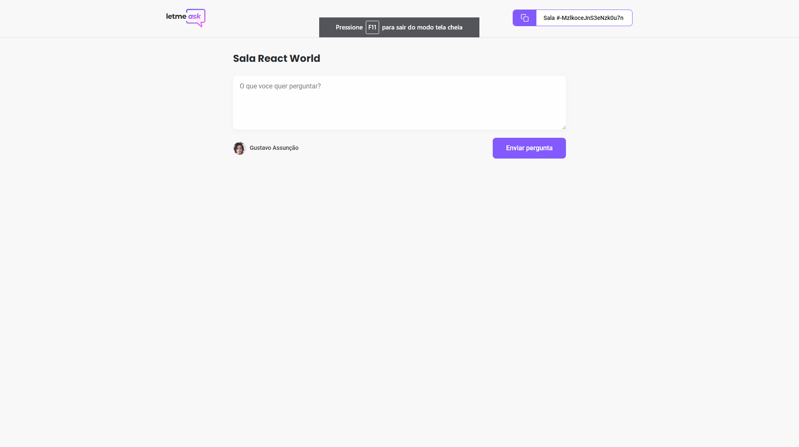

   

	
   
  
  
  

  💬  Projeto desenvolvido durante a NLW ( Next Level Week ) da | <a href="https://github.com/Rocketseat">@Rocketseat</a>

   Made with 💖 by
    <a href="https://github.com/gustavogk"> Gustavo Assunção.
    <h1></h1>
  

  
# 📌 Contents

* [Technologies](#rocket-technologies) 
* [Screenshots](#camera-screenshots) 
* [License](#page_facing_up-license)

# :rocket: Technologies
This project was made using the follow technologies:

* [Typescript](https://www.typescriptlang.org/)      
* [React](https://reactjs.org/)      
* [Firebase](https://firebase.google.com/)
* [Firebase Realtime Database](https://firebase.google.com/products/realtime-database/)
  
# :camera: Screenshots
  

   
   
  

  
# :page_facing_up: License

This project is under the [MIT license](./LICENSE).
Made with 💖 by [Gustavo Assunção](https://www.linkedin.com/in/gustavo-gk/). 

Thank you! 🌠
